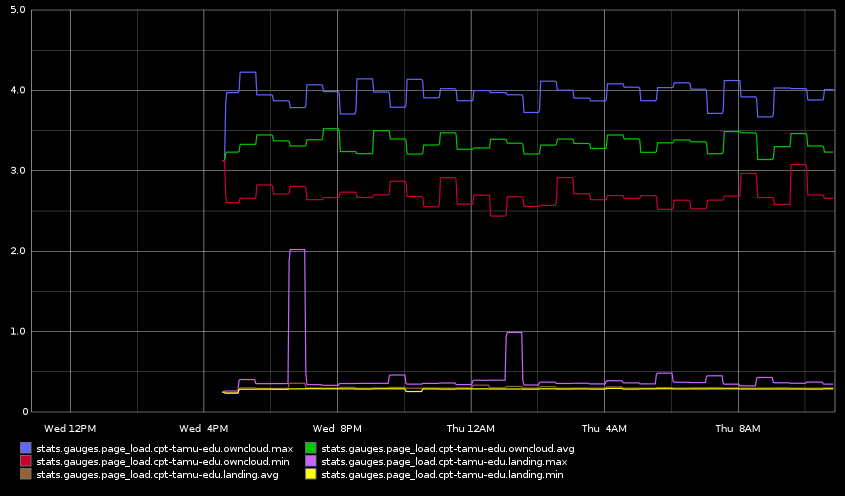

# AB to StatsD

In order to track page performance over time and provide actual numbers, needed
a simple script to output apache benchmark's results into statsd

## Configuration

Configuration is all stored in `conf.yaml`. Top level container in `urls`,
should be a StatsD acceptable name (i.e. no periods), every array of two values
within that consists of a slug and a url to test. No advanced test parameters
are supported yet (different HTTP methods, auth, etc)
