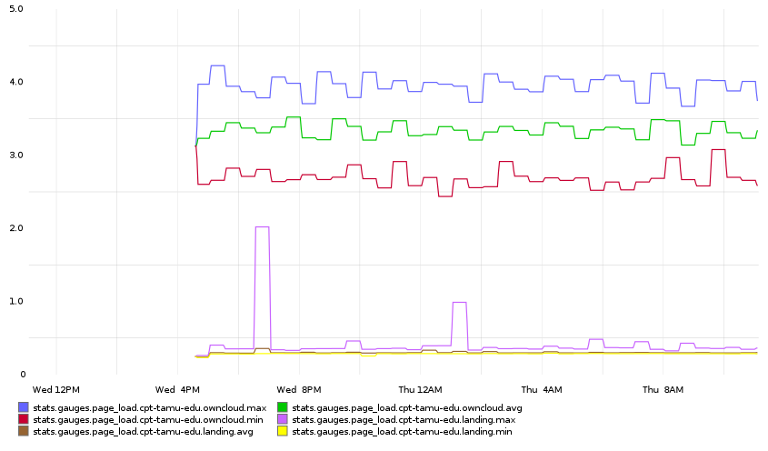

# AB to StatsD

In order to track page performance over time and provide actual numbers, needed
a simple script to output apache benchmark's results into statsd



## Configuration

Configuration is all stored in `conf.yaml`. Top level container in `urls`,
should be a StatsD acceptable name (i.e. no periods), every array of two values
within that consists of a slug and a url to test. No advanced test parameters
are supported yet (different HTTP methods, auth, etc)

## Known Issues

The script uses a simple gauge, rather than the nicer timing type. This is a
result of boom's output combined my lack of time to work on this issue. Boom
currently returns a json hash which is easy to parse; rather than hook into
Boom's code, the ease of parsing that won out, and we just return bulk
statistics.

These look like

```
page_load.web-site-name.service-name.count 3
page_load.web-site-name.service-name.total_time 0.567573785782
page_load.web-site-name.service-name.rps 5.28565637658
page_load.web-site-name.service-name.min 0.183543920517
page_load.web-site-name.service-name.max 0.196464061737
page_load.web-site-name.service-name.amp 0.0129201412201
page_load.web-site-name.service-name.avg 0.189072291056
```

PRs welcome!
